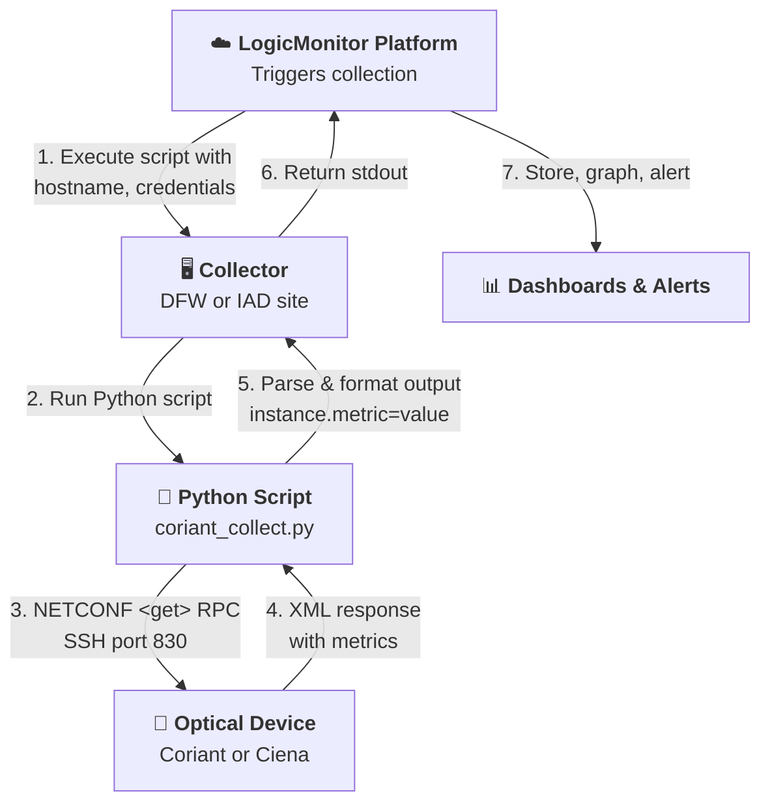

# High-Level Overview

Simple end-to-end flow of the monitoring system.

```mermaid
flowchart TB
    LM["☁️ <b>LogicMonitor Platform</b><br/>Triggers collection"]

    LM -->|"1. Execute script with<br/>hostname, credentials"| COL

    COL["🖥️ <b>Collector</b><br/>DFW or IAD site"]

    COL -->|"2. Run Python script"| PY

    PY["🐍 <b>Python Script</b><br/>coriant_collect.py"]

    PY -->|"3. NETCONF &lt;get&gt; RPC<br/>SSH port 830"| DEV

    DEV["📡 <b>Optical Device</b><br/>Coriant or Ciena"]

    DEV -->|"4. XML response<br/>with metrics"| PY

    PY -->|"5. Parse & format output<br/>instance.metric=value"| COL

    COL -->|"6. Return stdout"| LM

    LM -->|"7. Store, graph, alert"| OUT

    OUT["📊 <b>Dashboards & Alerts</b>"]
```
