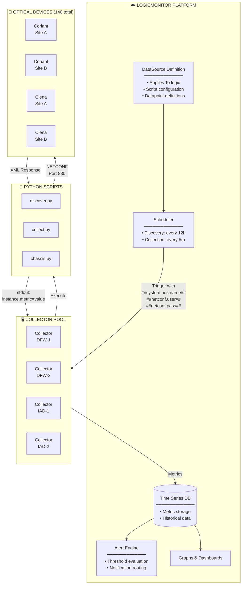

# Data Flow

Complete data flow from LogicMonitor platform to optical devices and back.

```mermaid
flowchart TB
    subgraph Platform["☁️ LOGICMONITOR PLATFORM"]
        DS["DataSource Definition<br/>━━━━━━━━━━━━━━<br/>• Applies To logic<br/>• Script configuration<br/>• Datapoint definitions"]
        Sched["Scheduler<br/>━━━━━━━━━━━━━━<br/>• Discovery: every 12h<br/>• Collection: every 5m"]
        Store[("Time Series DB<br/>━━━━━━━━━━━━━━<br/>• Metric storage<br/>• Historical data")]
        Alert["Alert Engine<br/>━━━━━━━━━━━━━━<br/>• Threshold evaluation<br/>• Notification routing"]
        Graph["Graphs & Dashboards"]
    end

    subgraph Collectors["🖥️ COLLECTOR POOL"]
        direction LR
        C1["Collector<br/>DFW-1"]
        C2["Collector<br/>DFW-2"]
        C3["Collector<br/>IAD-1"]
        C4["Collector<br/>IAD-2"]
    end

    subgraph Scripts["🐍 PYTHON SCRIPTS"]
        direction LR
        Disc["discover.py"]
        Coll["collect.py"]
        Chas["chassis.py"]
    end

    subgraph Devices["📡 OPTICAL DEVICES (140 total)"]
        direction LR
        Cor1["Coriant<br/>Site A"]
        Cor2["Coriant<br/>Site B"]
        Cie1["Ciena<br/>Site A"]
        Cie2["Ciena<br/>Site B"]
    end

    DS --> Sched
    Sched -->|"Trigger with<br/>##system.hostname##<br/>##netconf.user##<br/>##netconf.pass##"| Collectors
    Collectors -->|"Execute"| Scripts
    Scripts -->|"NETCONF<br/>Port 830"| Devices
    Devices -->|"XML Response"| Scripts
    Scripts -->|"stdout:<br/>instance.metric=value"| Collectors
    Collectors -->|"Metrics"| Store
    Store --> Alert
    Store --> Graph
```
