# Discovery vs Collection

LogicMonitor uses two separate processes with different purposes and schedules.

```mermaid
flowchart TB
    subgraph Discovery["🔍 ACTIVE DISCOVERY"]
        D_Desc["<b>Purpose:</b> Find what instances exist<br/><b>Frequency:</b> Every 4-24 hours<br/><b>Script:</b> coriant_discover.py"]

        D1["1️⃣ LM triggers discovery"]
        D2["2️⃣ Script connects via NETCONF"]
        D3["3️⃣ Query: What interfaces exist?"]
        D4["4️⃣ Parse XML for interface list"]
        D5["5️⃣ Output instance IDs + properties"]
        D6["6️⃣ LM creates/updates instances"]

        D_Desc --> D1 --> D2 --> D3 --> D4 --> D5 --> D6

        D_Out["<b>Output Format:</b><br/>ots-1/3.1/1##OTS Port##desc####auto.type=ots"]
    end

    subgraph Collection["📊 COLLECTION"]
        C_Desc["<b>Purpose:</b> Get metric values<br/><b>Frequency:</b> Every 2-5 minutes<br/><b>Script:</b> coriant_collect.py"]

        C1["1️⃣ LM triggers collection"]
        C2["2️⃣ Script connects via NETCONF"]
        C3["3️⃣ Query: Get all metrics"]
        C4["4️⃣ Parse XML for values"]
        C5["5️⃣ Output metrics per instance"]
        C6["6️⃣ LM stores values, checks alerts"]

        C_Desc --> C1 --> C2 --> C3 --> C4 --> C5 --> C6

        C_Out["<b>Output Format:</b><br/>ots-1/3.1/1.rx_optical_power=-48.3"]
    end

    D6 -.->|"Instances must<br/>exist before<br/>collection works"| C1
    D5 --> D_Out
    C5 --> C_Out
```

## Key Differences

| Aspect | Discovery | Collection |
|--------|-----------|------------|
| Purpose | Find instances | Get metrics |
| Output | Instance list | Metric values |
| Frequency | Hours | Minutes |
| Creates data? | No | Yes |
