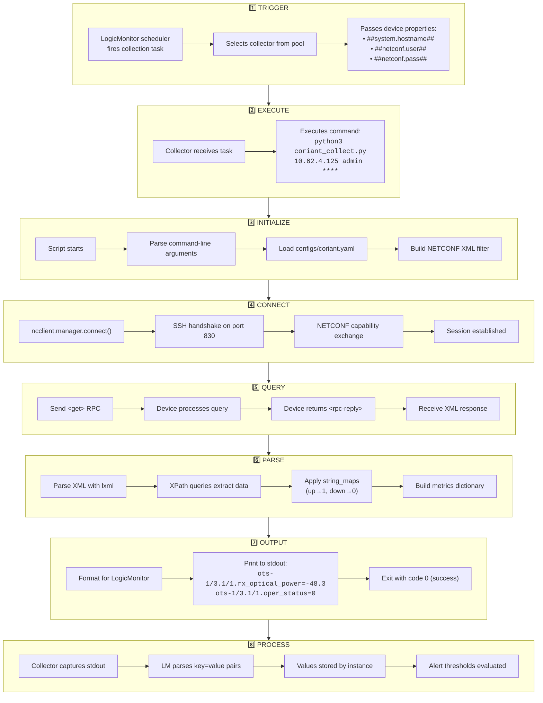

# Script Execution Sequence

Detailed sequence of what happens during a collection run.

```mermaid
flowchart TB
    subgraph Step1["1️⃣ TRIGGER"]
        S1A["LogicMonitor scheduler<br/>fires collection task"]
        S1B["Selects collector from pool"]
        S1C["Passes device properties:<br/>• ##system.hostname##<br/>• ##netconf.user##<br/>• ##netconf.pass##"]
        S1A --> S1B --> S1C
    end

    subgraph Step2["2️⃣ EXECUTE"]
        S2A["Collector receives task"]
        S2B["Executes command:<br/><code>python3 coriant_collect.py<br/>10.62.4.125 admin ****</code>"]
        S2A --> S2B
    end

    subgraph Step3["3️⃣ INITIALIZE"]
        S3A["Script starts"]
        S3B["Parse command-line arguments"]
        S3C["Load configs/coriant.yaml"]
        S3D["Build NETCONF XML filter"]
        S3A --> S3B --> S3C --> S3D
    end

    subgraph Step4["4️⃣ CONNECT"]
        S4A["ncclient.manager.connect()"]
        S4B["SSH handshake on port 830"]
        S4C["NETCONF capability exchange"]
        S4D["Session established"]
        S4A --> S4B --> S4C --> S4D
    end

    subgraph Step5["5️⃣ QUERY"]
        S5A["Send &lt;get&gt; RPC"]
        S5B["Device processes query"]
        S5C["Device returns &lt;rpc-reply&gt;"]
        S5D["Receive XML response"]
        S5A --> S5B --> S5C --> S5D
    end

    subgraph Step6["6️⃣ PARSE"]
        S6A["Parse XML with lxml"]
        S6B["XPath queries extract data"]
        S6C["Apply string_maps<br/>(up→1, down→0)"]
        S6D["Build metrics dictionary"]
        S6A --> S6B --> S6C --> S6D
    end

    subgraph Step7["7️⃣ OUTPUT"]
        S7A["Format for LogicMonitor"]
        S7B["Print to stdout:<br/><code>ots-1/3.1/1.rx_optical_power=-48.3<br/>ots-1/3.1/1.oper_status=0</code>"]
        S7C["Exit with code 0 (success)"]
        S7A --> S7B --> S7C
    end

    subgraph Step8["8️⃣ PROCESS"]
        S8A["Collector captures stdout"]
        S8B["LM parses key=value pairs"]
        S8C["Values stored by instance"]
        S8D["Alert thresholds evaluated"]
        S8A --> S8B --> S8C --> S8D
    end

    Step1 --> Step2 --> Step3 --> Step4 --> Step5 --> Step6 --> Step7 --> Step8
```
