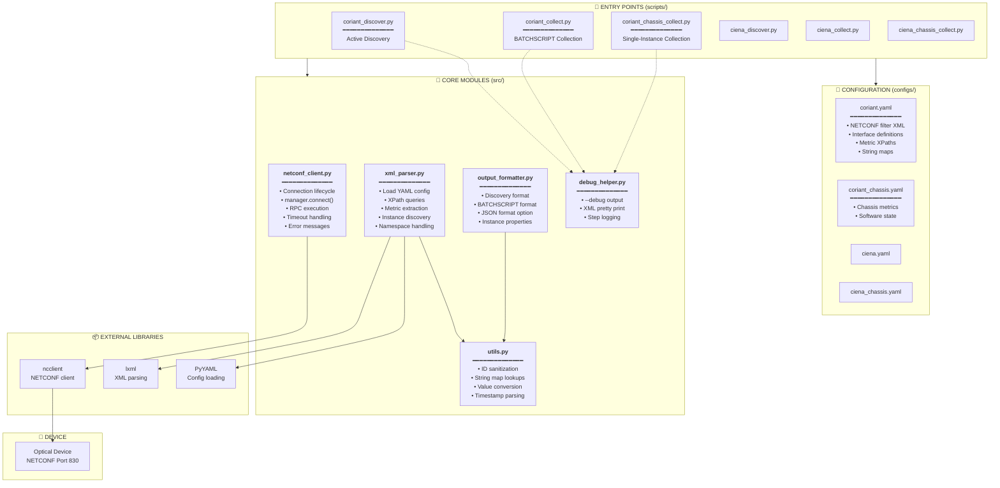

# Module Architecture

How the Python modules connect and their responsibilities.

```mermaid
flowchart TB
    subgraph Entry["📁 ENTRY POINTS (scripts/)"]
        E1["coriant_discover.py<br/>━━━━━━━━━━━━━━<br/>Active Discovery"]
        E2["coriant_collect.py<br/>━━━━━━━━━━━━━━<br/>BATCHSCRIPT Collection"]
        E3["coriant_chassis_collect.py<br/>━━━━━━━━━━━━━━<br/>Single-Instance Collection"]
        E4["ciena_discover.py"]
        E5["ciena_collect.py"]
        E6["ciena_chassis_collect.py"]
    end

    subgraph Config["📁 CONFIGURATION (configs/)"]
        CF1["coriant.yaml<br/>━━━━━━━━━━━━━━<br/>• NETCONF filter XML<br/>• Interface definitions<br/>• Metric XPaths<br/>• String maps"]
        CF2["coriant_chassis.yaml<br/>━━━━━━━━━━━━━━<br/>• Chassis metrics<br/>• Software state"]
        CF3["ciena.yaml"]
        CF4["ciena_chassis.yaml"]
    end

    subgraph Core["📁 CORE MODULES (src/)"]
        M1["<b>netconf_client.py</b><br/>━━━━━━━━━━━━━━<br/>• Connection lifecycle<br/>• manager.connect()<br/>• RPC execution<br/>• Timeout handling<br/>• Error messages"]

        M2["<b>xml_parser.py</b><br/>━━━━━━━━━━━━━━<br/>• Load YAML config<br/>• XPath queries<br/>• Metric extraction<br/>• Instance discovery<br/>• Namespace handling"]

        M3["<b>output_formatter.py</b><br/>━━━━━━━━━━━━━━<br/>• Discovery format<br/>• BATCHSCRIPT format<br/>• JSON format option<br/>• Instance properties"]

        M4["<b>utils.py</b><br/>━━━━━━━━━━━━━━<br/>• ID sanitization<br/>• String map lookups<br/>• Value conversion<br/>• Timestamp parsing"]

        M5["<b>debug_helper.py</b><br/>━━━━━━━━━━━━━━<br/>• --debug output<br/>• XML pretty print<br/>• Step logging"]
    end

    subgraph External["📦 EXTERNAL LIBRARIES"]
        EX1["ncclient<br/>NETCONF client"]
        EX2["lxml<br/>XML parsing"]
        EX3["PyYAML<br/>Config loading"]
    end

    subgraph Device["📡 DEVICE"]
        DEV["Optical Device<br/>NETCONF Port 830"]
    end

    Entry --> Config
    Entry --> Core

    M1 --> EX1
    M2 --> EX2
    M2 --> EX3
    M2 --> M4
    M3 --> M4

    EX1 --> DEV

    E1 -.-> M5
    E2 -.-> M5
    E3 -.-> M5
```
