# LogicMonitor DataSource Structure

How DataSources, instances, and datapoints are organized.

```mermaid
flowchart TB
    subgraph Device["📡 DEVICE: coriant-dfw-01"]
        Props["<b>Device Properties</b><br/>━━━━━━━━━━━━━━━━━━━━<br/>system.hostname = 10.62.4.125<br/>netconf.user = admin<br/>netconf.pass = ********<br/>netconf.vendor = Coriant"]
    end

    subgraph DS1["📊 DATASOURCE: Coriant_Optical_Interfaces"]
        DS1_Info["<b>Configuration</b><br/>━━━━━━━━━━━━━━━━━━━━<br/>Type: BATCHSCRIPT (multi-instance)<br/>Applies To: netconf.vendor == 'Coriant'<br/>Collection: Every 5 minutes"]

        subgraph AD["🔍 Active Discovery"]
            AD_Info["Script: coriant_discover.py<br/>Params: ##system.hostname## ##netconf.user## ##netconf.pass##<br/>Schedule: Every 12 hours"]
        end

        subgraph Instances["📋 Discovered Instances"]
            I1["<b>ots-1/3.1/1</b><br/>type=ots<br/>fiber=SSMF"]
            I2["<b>oms-1/3.1/1</b><br/>type=oms<br/>grid=fixed_100G"]
            I3["<b>osc-1/3.1/1</b><br/>type=osc<br/>mode=155M52"]
            I4["<b>gopt-1/3.1/2</b><br/>type=gopt"]
        end

        subgraph Coll["📈 Collection"]
            Coll_Info["Script: coriant_collect.py<br/>Params: ##system.hostname## ##netconf.user## ##netconf.pass##"]
        end

        subgraph DP["📉 Datapoints (per instance)"]
            DP1["<b>rx_optical_power</b><br/>Key: ##WILDVALUE##.rx_optical_power<br/>Alert: &lt; -25 dBm"]
            DP2["<b>tx_optical_power</b><br/>Key: ##WILDVALUE##.tx_optical_power"]
            DP3["<b>oper_status</b><br/>Key: ##WILDVALUE##.oper_status<br/>Alert: == 0"]
            DP4["<b>admin_status</b><br/>Key: ##WILDVALUE##.admin_status"]
        end

        DS1_Info --> AD --> Instances --> Coll --> DP
    end

    subgraph DS2["📊 DATASOURCE: Coriant_Chassis"]
        DS2_Info["<b>Configuration</b><br/>━━━━━━━━━━━━━━━━━━━━<br/>Type: SCRIPT (single-instance)<br/>No Active Discovery needed<br/>Collection: Every 5 minutes"]

        subgraph Coll2["📈 Collection"]
            Coll2_Info["Script: coriant_chassis_collect.py"]
        end

        subgraph DP2s["📉 Datapoints"]
            DP2_1["<b>ne_temperature</b><br/>Alert: &gt; 45°C"]
            DP2_2["<b>ne_altitude</b>"]
            DP2_3["<b>swload_active</b>"]
        end

        DS2_Info --> Coll2 --> DP2s
    end

    Device --> DS1
    Device --> DS2
```

## ##WILDVALUE## Explained

The `##WILDVALUE##` token is replaced by LogicMonitor with each instance ID:

| Instance | Datapoint Key | Matches Script Output |
|----------|---------------|----------------------|
| ots-1/3.1/1 | ##WILDVALUE##.rx_optical_power | ots-1/3.1/1.rx_optical_power=-48.3 |
| oms-1/3.1/1 | ##WILDVALUE##.rx_optical_power | oms-1/3.1/1.rx_optical_power=-12.5 |
