# Collector Deployment Topology

How collectors are distributed across sites to monitor optical devices.

```mermaid
flowchart TB
    subgraph Cloud["☁️ LOGICMONITOR PLATFORM"]
        LM["LogicMonitor SaaS<br/>━━━━━━━━━━━━━━<br/>• DataSource definitions<br/>• Metric storage<br/>• Alerting<br/>• Dashboards"]
    end

    subgraph ABG["⚖️ AUTO-BALANCED COLLECTOR GROUP"]
        ABG_Info["Distributes 140 devices<br/>across all collectors"]
    end

    subgraph DFW["🏢 DFW SITE"]
        DFW_C1["Collector DFW-1<br/>━━━━━━━━━━━━━━<br/>~35 devices"]
        DFW_C2["Collector DFW-2<br/>━━━━━━━━━━━━━━<br/>~35 devices"]
        DFW_C3["Collector DFW-3<br/>━━━━━━━━━━━━━━<br/>~35 devices"]

        subgraph DFW_Dev["DFW Optical Devices"]
            DFW_D1["Coriant"]
            DFW_D2["Coriant"]
            DFW_D3["Ciena"]
        end
    end

    subgraph IAD["🏢 IAD SITE"]
        IAD_C1["Collector IAD-1<br/>━━━━━━━━━━━━━━<br/>~35 devices"]
        IAD_C2["Collector IAD-2<br/>━━━━━━━━━━━━━━<br/>~35 devices"]

        subgraph IAD_Dev["IAD Optical Devices"]
            IAD_D1["Coriant"]
            IAD_D2["Ciena"]
        end
    end

    LM <--> ABG
    ABG <--> DFW_C1
    ABG <--> DFW_C2
    ABG <--> DFW_C3
    ABG <--> IAD_C1
    ABG <--> IAD_C2

    DFW_C1 & DFW_C2 & DFW_C3 -->|"NETCONF<br/>Port 830"| DFW_Dev
    IAD_C1 & IAD_C2 -->|"NETCONF<br/>Port 830"| IAD_Dev
```

## Collector Requirements

Each collector needs:

| Component | Requirement |
|-----------|-------------|
| OS | Linux (RHEL, Ubuntu, etc.) |
| Python | 3.9 or higher |
| Packages | ncclient, lxml, pyyaml |
| Network | Access to devices on port 830 |
