# NETCONF Session Detail

Low-level NETCONF protocol exchange.

```mermaid
flowchart TB
    subgraph Script["🐍 PYTHON SCRIPT"]
        S1["ncclient.manager.connect()"]
    end

    subgraph SSH["🔐 SSH TRANSPORT"]
        SSH1["TCP connection to port 830"]
        SSH2["SSH key exchange"]
        SSH3["SSH authentication<br/>(username/password)"]
        SSH4["SSH channel established"]
    end

    subgraph Hello["👋 NETCONF HELLO"]
        H1["Client sends &lt;hello&gt;<br/>with capabilities"]
        H2["Server sends &lt;hello&gt;<br/>with capabilities"]
        H3["Session ID assigned"]
    end

    subgraph RPC["📤 NETCONF RPC"]
        R1["Client sends:<br/>&lt;rpc&gt;<br/>  &lt;get&gt;<br/>    &lt;filter type='subtree'&gt;<br/>      ...XML filter...<br/>    &lt;/filter&gt;<br/>  &lt;/get&gt;<br/>&lt;/rpc&gt;"]
        R2["Server processes query"]
        R3["Server sends:<br/>&lt;rpc-reply&gt;<br/>  &lt;data&gt;<br/>    ...metrics XML...<br/>  &lt;/data&gt;<br/>&lt;/rpc-reply&gt;"]
    end

    subgraph Parse["🔍 PARSE RESPONSE"]
        P1["Extract XML data"]
        P2["XPath queries"]
        P3["Build metrics dict"]
    end

    subgraph Close["🔚 CLOSE SESSION"]
        CL1["Client sends &lt;close-session/&gt;"]
        CL2["Server confirms"]
        CL3["SSH channel closed"]
    end

    Script --> SSH
    SSH1 --> SSH2 --> SSH3 --> SSH4
    SSH4 --> Hello
    H1 --> H2 --> H3
    H3 --> RPC
    R1 --> R2 --> R3
    R3 --> Parse
    P1 --> P2 --> P3
    P3 --> Close
    CL1 --> CL2 --> CL3
```

## NETCONF Capabilities

Common capabilities exchanged:

| Capability | Description |
|------------|-------------|
| urn:ietf:params:netconf:base:1.0 | NETCONF base protocol |
| urn:ietf:params:netconf:base:1.1 | NETCONF 1.1 (chunked framing) |
| urn:ietf:params:netconf:capability:writable-running:1.0 | Can write to running config |
| (vendor-specific) | Device-specific YANG models |
